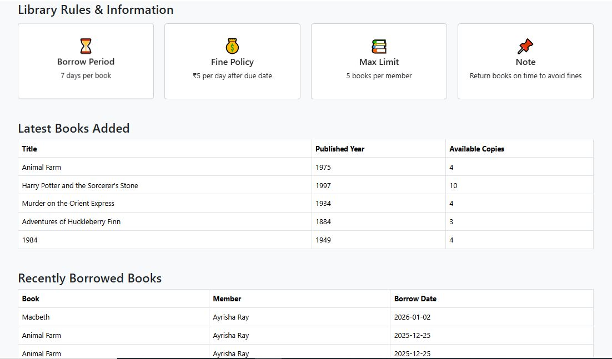
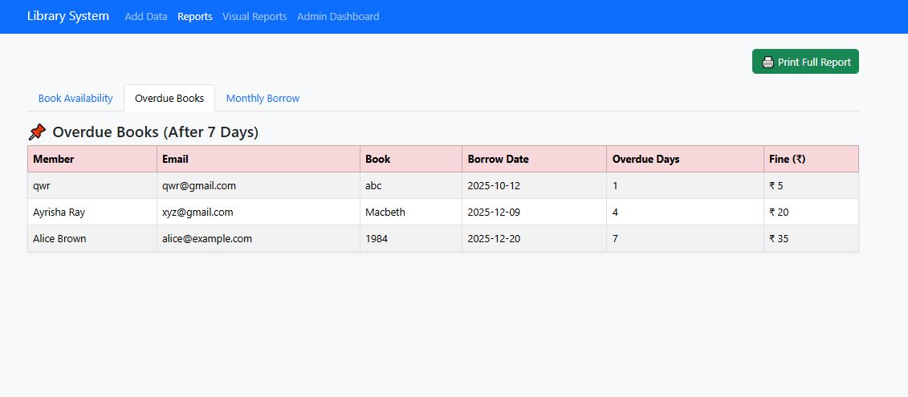
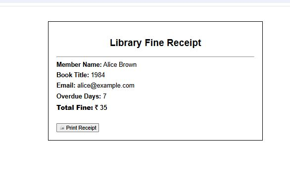

# Library Management System

A PHP and Oracle-based Library Management System.

## Project Screenshots

### Login Page

### Admin Dashboard

### Form (On filling the form the data get stored in the database)

### Reports

### Visual Report

### Fine Receipt

### Database

## Features
- Author, Book, Member Management
- Borrow & Return Records
- Overdue Fine Calculation
- Data Visualization using Highcharts

## Technologies Used
- PHP
- Oracle Database
- OCI8
- Bootstrap 5
- Highcharts

## Security
- Database credentials are stored in a separate config file
- config.php is excluded using .gitignore

## Setup Instructions
1. Install Oracle Database
2. Enable OCI8 in PHP
3. Import database.sql
4. Create config.php with DB credentials
5. Run using XAMPP / Apache
